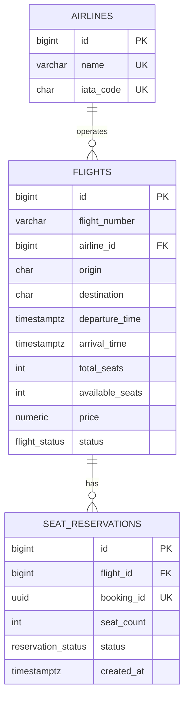
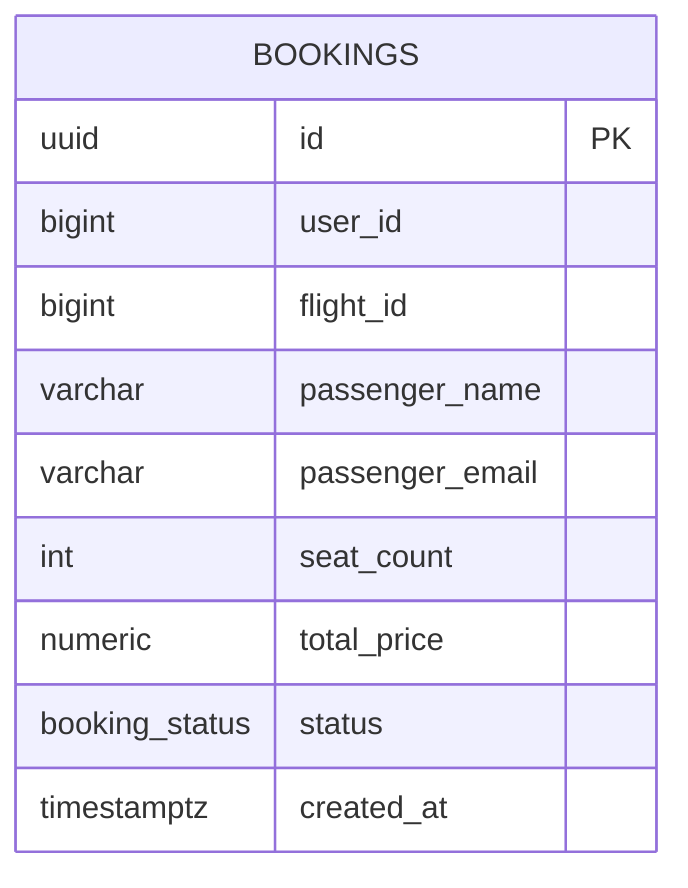

Flight Service

```mermaid
erDiagram
    AIRLINES ||--o{ FLIGHTS : operates
    FLIGHTS ||--o{ SEAT_RESERVATIONS : has

    AIRLINES {
        bigint id PK
        varchar name UK
        char iata_code UK
    }

    FLIGHTS {
        bigint id PK
        varchar flight_number
        bigint airline_id FK
        char origin
        char destination
        timestamptz departure_time
        timestamptz arrival_time
        int total_seats
        int available_seats
        numeric price
        flight_status status
    }

    SEAT_RESERVATIONS {
        bigint id PK
        bigint flight_id FK
        uuid booking_id UK
        int seat_count
        reservation_status status
        timestamptz created_at
    }
```

Booking Service

```mermaid
erDiagram
    BOOKINGS {
        uuid id PK
        bigint user_id
        bigint flight_id
        varchar passenger_name
        varchar passenger_email
        int seat_count
        numeric total_price
        booking_status status
        timestamptz created_at
    }
```
